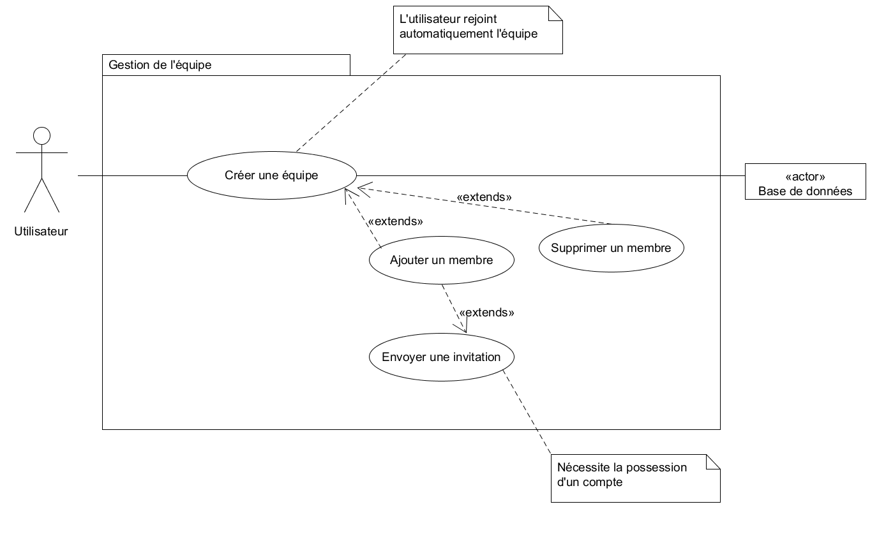
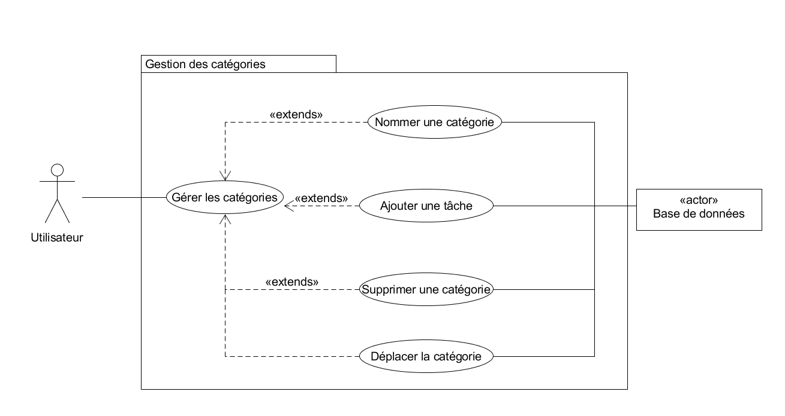
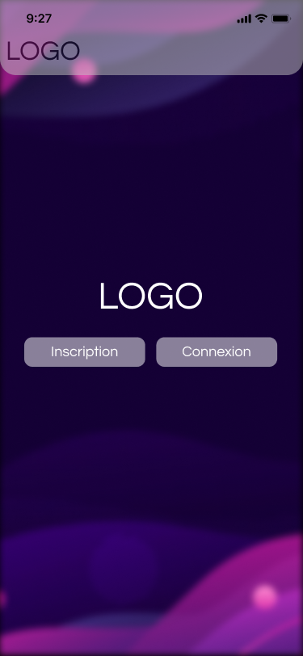
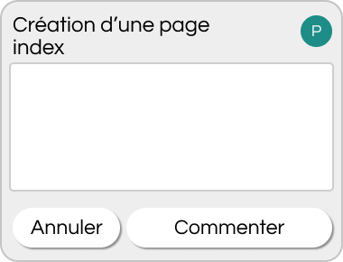
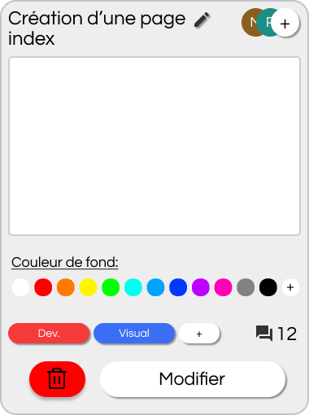

[Filenager]

 
 
  *CIAJOLO Mateo, HANICOTTE Eulalie, VAZART Paul, LECLAIRE Thibaut, SENEJOUX Noah, RIMBERT Bastien*

# Cahier des charges
## **Qu’est-ce qu’une application de gestion de projet ?**
Il s’agit d’une application ou d’un site web permettant de créer des tâches pouvant être assignées à des membres de l’équipe pour une meilleure organisation des tâches à la réalisation, chaque tableau peut être décomposé en catégories puis en tâches, que l’on peut nommer, décrire et supprimer à volonté. Il est même possible de déplacer les catégories et tâches pour mieux les organiser. De plus, cela permet de travailler et collaborer à plusieurs sur un même projet.

*Exemple d’un tableau composé de catégories, elles-même composé de tâches.*

*Exemple d’une catégorie présentant*

**Nom de catégorie / Tâche / Étiquettes de tâche**
## **Présentation du projet**
### ***Qui ?***
- MOA, Maître d’Ouvrage
  - IUT
- MOE, Maître d’Oeuvre 
  - Groupe PRJ13
    - CIAJOLO Mateo
    - HANICOTTE Eulalie
    - LECLAIRE Thibaut
    - PERDERIZET Maïa
    - RIMBERT Bastien
    - SENEJOUX Noah
    - VAZART Paul
  - Superviseur
    - CUTRONA Jérôme
### ***Pourquoi ce projet ?***
Les gestionnaires de projets sont communs mais chacun peut fournir des fonctionnalités qui ne sont pas forcément celles que nous cherchons. Le but de ce projet est donc de créer une version différente de gestionnaire de projet et d’y ajouter des fonctionnalités intéressantes et innovantes.

Les utilisateurs peuvent gérer eux même les tâches définies dans leur tableau et créer des équipes pour collaborer à plusieurs.
### ***Périmètre*** 
- Délai : 2 semaines
- Coût : 0 euros.
- Qualité / Objectif : Créer un site Web permettant d’organiser et gérer des tâches
### ***Contraintes***
- L’équipe travaille en distanciel
- La durée est de 2 semaines
## **Prestations attendues**
### ***Fonctionnalités***
- Interfaçage à une base de donnée
- Developpement IHM
- Fonctionnalités du gestionnaire :
  - Principales :
    - Connexion utilisateur
      - Créer un compte
        - Confirmer le mot de passe
      - Se connecter
      - Se déconnecter
      - Modifier ses informations de compte
        - Modifier son nom, prénom, pseudo, adresse-mail, mot de passe
    - Gestion de l’équipe
      - Créer une équipe
        - Par un utilisateur qui la rejoint automatiquement
        - Ajouter un membre
          - Envoi d’une invitation
          - Requiert un compte pour rejoindre
        - Supprimer un membre
      - Ajouter un tableau à l’équipe
      - Supprimer une équipe
      - Quitter une équipe
    - Gestion des tableaux :
      - Nommer un tableau
      - Ajout d’une catégorie au tableau
      - Suppression du tableau
    - Gestion des catégories : 
      - Nommer une catégorie
      - Ajout d’une tâche à la catégorie
      - Suppression de la catégorie
      - Déplacer la catégorie (changer d’ordre)
    - Gestion des tâches : 
      - Nommer une tâche
      - Décrire une tâche
      - Déplacer une tâche d’une catégorie à une autre
      - Déplacer la tâche (changer d’ordre)
      - Suppression de la tâche
      - Valider la tâche
  - Complémentaires :
    - Personnalisation du tableau
    - Gestion des tâches
      - Affecter un/des utilisateurs à une tâche
      - Commenter une tâche
        - Création d’un fil de discussion
        - Par un/des utilisateur(s)
        - Possibilité de commenter un commentaire
        - Suppression d’un commentaire
      - Hiérarchisation/Dépendance des tâches :
        - Définir les tâches “filles”
      - Classer les tâches en type (niveau de priorité)
      - Affecter une date de début / fin à la tâche
    - Etiquetage des tâches :
      - Créer une étiquette
      - Modifier une étiquette
      - Colorer une étiquette
      - Supprimer une étiquette
    - Gestion de l’équipe
      - Attribuer des rôles
      - Changer les rôles
### ***Matériel informatique nécessaire***
- Téléphone, ordinateur, tablettes…
- Hébergement Web
- Base de donnée (SQL)
### ***Délai de réalisation***
2 semaines. 

Du  31.05.2021  au  11.06.2021.
### ***Budget***
` `0 euros.
### ***Langue***
Français.
### ***Public visé***
Clients et futurs clients, entreprises, étudiants et universités.
# Planning
**RBS (Resource Breakdown Structure), 
hiérarchisation des acteurs/ressources du projet**
--------------------------------------------------
## 
PAGE
**WBS (Work Breakdown Structure), 
Hiérarchisation et structuration des tâches du projet**
-------------------------------------------------------
PHASE 1:

-----

PHASE 2 :

PHASE 3 :

-----

-----
PHASE 4 :

# **Diagramme de Gantt**
***Planification du projet et répartition des tâches.***

#

Les tâches optionnelles n’étant pas prioritaires, celles-ci sont prévues pour le dernier jour de projet et ne sont pas encore attribuées. 				

Ce planning est à titre informatif et peut différer du réel déroulement.

# Modélisation Base de Données
Soit la base de données relative à une application de gestion de projet qui organise et répartit des tâches - classées en catégories et organisées dans des tableaux - entre les membres d’une équipe.

Les tâches sont regroupées dans des catégories, elles-même contenues dans des tableaux. Les tâches peuvent avoir un type.

Une tâche est définie par un identifiant, un nom, une description, un ordre, une date de début et une date de fin. Elle possède également un statut permettant de la définir “A Faire, En cours, Terminée ou Abandonnée”.

A chaque catégorie correspond plusieurs tâches et une tâche appartient à une seule catégorie.

Ainsi, à chaque tableau on peut affilier plusieurs catégories et une catégorie est affiliée à un tableau.
## **Liste des informations**

|**Nom**|**Code**|**Commentaire et Contraintes d’intégrité**|
| :- | :- | :- |
|Code de la couleur|codeCouleur|Code associé à la couleur|
|Contenu du commentaire|contenuCom||
|Date de début de la tâche|dateDebTache|Date du jour par défaut (SYSDATE)|
|Date de fin de la tâche|dateFinTache|Doit être supérieure à dateDebTache|
|Date du commentaire|dateCom|Date du jour par défaut (SYSDATE)|
|Date de l’invation|dateInvit|Date du jour par défaut (SYSDATE)|
|Description de la tâche|descTache||
|Identifiant de l’équipe|idEquipe|Ex : 1, 2, 3...|
|Identifiant de l’étiquette|idTag||
|Identifiant de l’utilisateur|idUser||
|Identifiant de la catégorie|idCat||
|Identifiant de la couleur|idCouleur||
|Identifiant de la tâche|idTache||
|Identifiant du commentaire|idCom||
|Identifiant du rôle|idRole||
|Identifiant du tableau|idTab||
|Identifiant de l’étiquette|idTag||
|Identifiant du type de tâche|idTypeTache||
|Libellé du rôle|libRole||
|Libellé du type de tâche|libTypeTache||
|Email de l’utilisateur|mailUser||
|Mot de passe de l’utilisateur|mdpUser||
|Nom de l’équipe|nomEquipe||
|Nom de l’étiquette|nomTag||
|Nom de l’utilisateur|nomUser||
|Nom de la catégorie|nomCat||
|Nom de la tâche|nomTache||
|Nom du tableau|nomTab||
|Ordre de la catégorie|ordreCat|` `> 0|
|Ordre de la tâche|ordreTache|` `> 0|
|Prénom de l’utilisateur|pnomUser||
|Pseudo de l’utilisateur|pseudoUser|Pseudo choisi par l’utilisateur lors de l’inscription.|
|Statut de la tâche|statut|Ex : T,  E, F  , A : Terminée, En cours, A faire, Abandonnée.|
###
## **Modèle Conceptuel de Données (MCD) : **
## **Modèle Logique de Données (MLD) :**

|**UTIISATEUR** (idUser, mailUser, mdpUser, pseudoUser, nomUser, pnomUser)|
| :- |
|**TABLEAU** (idTab, nomTab)|
|**COULEUR** (idCouleur, codeCouleur)|
|**TYPE\_TACHE** (idTypeTache, libTypeTache)|
|**EQUIPE** (idEquipe, nomEquipe)|
|**ROLE** (idRole, libRole)|
|**CATEGORIE** (idCat, nomCat, ordreCat, #idTab)|
|**TACHE** (idTache, nomTache, descTache, ordreTache, dateDebTache, dateFinTache, statut,  #idCat, #idTypeTache)|
|**ETIQUETTE** (idTag, nomTag, #idTab, #idCouleur)|
|**COMMENTAIRE** (idCom, contenuCom, dateCom, #idTache, #idUser, #idComParent)|
|**INVITATION** (#idUser, #idEquipe, dateInvit)|
|**POSSESSION** (#idEquipe, #idTab)|
|**ETIQUETTAGE** (#idTag, #idTache)|
|**NECESSITER** (#idTache, #idTacheParent)|
|**CONSTITUER** (#idUser, #idEquipe, #idRole)|
##
## **Modèle Physique de Données (MPD) :**

## **Diagramme de classes (DC) : **

## **Diagramme des classes *Component* : **

## **Use-Case, différents cas d’utilisation :** 
### ***Gestion des comptes et connexions :*** 

###
###
###
###
###
###
###
### ***Gestion des équipes :***

### ***Gestion d’un tableau :*** 

### ***Gestion des catégories :*** 

### ***Gestion des tâches :***

### ***Partage d’un tableau :*** 

### ***Gestion des tâches, fonctionnalités optionnelles : ***
##
##
##
##
##

|
Pour voir le diagramme de classe ainsi que l’ensemble des éléments en taille originale, rendez-vous sur notre Google Drive :

<https://drive.google.com/drive/folders/1Df31ABhfhnc4jLOpcmnjXVsFn5bKRPJx?usp=sharing> 
|
| :-: |

## **

## **Maquettes et interfaces :** 

|Pour tester ces maquettes et leurs fonctionnalités, vous pouvez vous rendre sur : <https://www.figma.com/file/ooAIitzvhS0OgTZCvEI9dZ/Interface-Gestion-de-projet?node-id=0%3A1> |
| :-: |
###
### ***Page d’accueil :***
### 

###
###
###
###
###
###
###

###

### ***Pages de connexion et d’inscription :***

### ***Page de profil et création d’un tableau :***                                                                                       
`  `

### ***Page d'une équipe :***

###
###
###
###
###
###
### ***Fil de commentaires et création d’un commentaire :***

### ***Page tableau et liste des participants :***

### ***Modification d’une tâche : ***
